# Domain Model

Two views of the same domain, kept in one doc since they describe the same
system from different altitudes:

1. **Conceptual domain model** — aggregates, behavior, invariants. Business
   language, no DB concern.
2. **ERD** — Postgres schema as implemented (PK/FK/columns), plus external
   system refs. Implementation detail.

## Conceptual Domain Model

Source: aggregate boundaries inferred from `internal/bizs/*.go` (transaction
scoping via `RunInTx`) and lifecycle rules from `internal/fsm/*.go`.

```mermaid
classDiagram
    class User {
        <<Aggregate Root>>
        username
        kycStatus
        role
        register()
        login()
    }
    class KYC {
        <<Aggregate Root>>
        status
        submit()
        approve()
        reject()
    }
    class Account {
        <<Aggregate Root>>
        custodyType
        status
    }
    class Wallet {
        <<Value Object>>
        chainName
        address
    }
    class TokenBalance {
        <<Value Object>>
        token
        balance
    }
    class Deposit {
        <<Process>>
        status
        initiate()
        confirmPayment()
        confirmMint()
    }
    class Withdrawal {
        <<Process>>
        status
        initiate()
        burnOnChain()
        payoutBank()
    }
    class Transfer {
        <<Process>>
        status
        send()
    }
    class Swap {
        <<Process>>
        status
        quote()
        execute()
    }
    class CryptoTxn {
        <<Ledger Entry>>
        direction
        amount
        record()
    }
    class SuiBlockchain {
        <<External System>>
    }
    class PaymentGateway {
        <<External System>>
    }
    class PriceFeed {
        <<External System>>
    }

    User "1" *-- "0..1" KYC : verifies identity via
    User "1" *-- "1..*" Account : owns
    Account "1" *-- "1..*" Wallet : provisions
    Account "1" *-- "0..*" TokenBalance : tracks off-chain
    Account "1" --> "0..*" Deposit : initiates
    Account "1" --> "0..*" Withdrawal : initiates
    Account "1" --> "0..*" Swap : initiates
    Account "1" --> "0..*" Transfer : sends
    Account "0..1" <-- "0..*" Transfer : receives
    Account "1" --> "0..*" CryptoTxn : audited by

    Deposit ..> PaymentGateway : pays via
    Deposit ..> SuiBlockchain : mints via
    Withdrawal ..> SuiBlockchain : burns via
    Withdrawal ..> PaymentGateway : pays out via
    Transfer ..> SuiBlockchain : moves via
    Swap ..> SuiBlockchain : settles on-chain leg via
    Swap ..> PriceFeed : quoted from
    CryptoTxn ..> SuiBlockchain : verified against (if not simulated)

    note for Account "Invariant: balance never negative.\nOne wallet per provisioned chain."
    note for Deposit "FSM: PENDING -> PROCESSING_WEB3 -> SUCCESS\nany stage -> FAILED.\nFiat received BEFORE mint attempted."
    note for Withdrawal "FSM: PENDING -> PROCESSING_WEB3 -> PROCESSING_FIAT -> SUCCESS\nweb3/fiat failure -> FAILED.\nCrypto burned BEFORE fiat payout (locks funds first)."
    note for Swap "FSM: PENDING -> PROCESSING -> SUCCESS/FAILED.\nOff-chain tokens (BTC/ETH/USDT/USDC) skip SuiBlockchain, settle in TokenBalance ledger only."
    note for Transfer "FSM: PENDING -> PROCESSING -> SUCCESS/FAILED.\nReceiver Account optional — set only if recipient address resolves to an internal account."
    note for CryptoTxn "Immutable audit trail.\nsimulated=true rows never touch SuiBlockchain.\nMust reconcile with TokenBalance running total."

    cssClass "User,KYC" identityStyle
    cssClass "Account" hubStyle
    cssClass "Wallet,TokenBalance" valueObjStyle
    cssClass "Deposit,Withdrawal,Transfer,Swap" processStyle
    cssClass "CryptoTxn" ledgerStyle
    cssClass "SuiBlockchain,PaymentGateway,PriceFeed" externalStyle

    classDef identityStyle fill:#a5d8ff,stroke:#1864ab,stroke-width:2px,color:#0b3d66
    classDef hubStyle fill:#d0bfff,stroke:#5f3dc4,stroke-width:3px,color:#3b2470
    classDef valueObjStyle fill:#c3fae8,stroke:#0b7285,stroke-width:2px,color:#063b45
    classDef processStyle fill:#ffd8a8,stroke:#d9480f,stroke-width:2px,color:#7a2a06
    classDef ledgerStyle fill:#eebefa,stroke:#862e9c,stroke-width:2px,color:#4a1759
    classDef externalStyle fill:#ffc9c9,stroke:#c92a2a,stroke-width:2px,stroke-dasharray: 4 2,color:#7a1414
```

## ERD (Schema + External Refs)

Source: `internal/models/*.go` (internal, persisted in Postgres) plus the external
systems the biz layer talks to (`internal/clients/`, `internal/clients/chains/`).

Legend:
- Solid line (`--`) = real FK relationship inside Postgres.
- Dashed line (`..`) = logical reference to an external system (no DB FK — tied
  together by a string field like `tx_hash`, `gateway_ref_id`, `tx_ref`).

```mermaid
erDiagram
    USER ||--o{ ACCOUNT : owns
    USER ||--o| KYC : has

    ACCOUNT ||--o{ WALLET : owns
    ACCOUNT ||--o{ DEPOSIT : initiates
    ACCOUNT ||--o{ WITHDRAWAL : initiates
    ACCOUNT ||--o{ SWAP : initiates
    ACCOUNT ||--o{ TOKEN_BALANCE : holds
    ACCOUNT ||--o{ CRYPTO_TXN : logs
    ACCOUNT ||--o{ TRANSFER : sends
    ACCOUNT o|--o{ TRANSFER : "receives (optional)"

    WALLET }o..o{ SUI_BLOCKCHAIN : "address owns coin objects on"
    DEPOSIT }o..|| SUI_BLOCKCHAIN : "tx_hash mint verified via"
    WITHDRAWAL }o..|| SUI_BLOCKCHAIN : "burns MYRC via"
    TRANSFER }o..|| SUI_BLOCKCHAIN : "on-chain transfer via"
    SWAP }o..|| SUI_BLOCKCHAIN : "on-chain leg executes via"
    CRYPTO_TXN }o..|| SUI_BLOCKCHAIN : "tx_ref verified against (if not simulated)"

    DEPOSIT }o..|| PAYMENT_GATEWAY : "creates bill via"
    WITHDRAWAL }o..|| PAYMENT_GATEWAY : "payout via"

    SWAP }o..|| PRICE_FEED : "rate quoted from (client-side via WS)"

    USER {
        uuid id PK
        string username UK
        string phone_number UK
        string email UK
        string password_hash
        string pin_hash
        string kyc_status "PENDING|APPROVED|REJECTED"
        string role "USER|ADMIN"
        datetime created_at
        datetime updated_at
    }

    ACCOUNT {
        uuid id PK
        uuid user_id FK
        string account_name
        string custody_type "SERVER|SELF"
        string status "ACTIVE|INACTIVE"
        datetime created_at
        datetime updated_at
    }

    WALLET {
        uuid id PK
        uuid account_id FK
        string chain_name "SUI|ETHEREUM|SOLANA|POLYGON"
        string address UK
        string private_key
        string status "ACTIVE|INACTIVE"
        datetime created_at
        datetime updated_at
    }

    KYC {
        uuid id PK
        uuid user_id FK,UK
        string full_name
        string ic_number "AES-encrypted"
        string ic_front_photo "AES-encrypted base64"
        string ic_back_photo "AES-encrypted base64"
        string status "PENDING|APPROVED|REJECTED"
        string remarks
        datetime created_at
        datetime updated_at
    }

    DEPOSIT {
        uuid id PK
        uuid account_id FK
        float amount_myr
        float amount_myrc
        string status "PENDING|PROCESSING_WEB3|SUCCESS|FAILED"
        string gateway_ref_id UK
        string tx_hash
        string payment_url
        datetime created_at
        datetime updated_at
    }

    WITHDRAWAL {
        uuid id PK
        uuid account_id FK
        float amount_myrc
        float amount_myr
        string bank_name
        string bank_account_no
        string status "PENDING|PROCESSING_WEB3|PROCESSING_FIAT|SUCCESS|FAILED"
        string tx_hash
        string gateway_ref_id
        datetime created_at
        datetime updated_at
    }

    TRANSFER {
        uuid id PK
        uuid sender_account_id FK
        uuid receiver_account_id FK "nullable, set if recipient is internal"
        string to_address
        float amount
        string status "PENDING|PROCESSING|SUCCESS|FAILED"
        string tx_hash
        datetime created_at
        datetime updated_at
    }

    SWAP {
        uuid id PK
        uuid account_id FK
        string from_token "SUI|MYRC|BTC|ETH|USDT|USDC"
        string to_token "SUI|MYRC|BTC|ETH|USDT|USDC"
        float from_amount
        float estimated_to_amount
        float actual_to_amount
        float slippage_tolerance
        string status "PENDING|PROCESSING|SUCCESS|FAILED"
        string tx_hash
        datetime created_at
        datetime updated_at
    }

    TOKEN_BALANCE {
        uuid id PK
        uuid account_id FK "unique with token"
        string token "BTC|ETH|USDT|USDC (off-chain ledger only)"
        float balance
        datetime created_at
        datetime updated_at
    }

    CRYPTO_TXN {
        uuid id PK
        uuid account_id FK
        string token
        string direction "DEPOSIT|WITHDRAW"
        float amount
        string tx_ref "on-chain digest or synthetic ref"
        boolean simulated "true for BTC/ETH/USDT/USDC"
        string status
        datetime created_at
        datetime updated_at
    }

    SUI_BLOCKCHAIN {
        string package_id "MYRC_SUI_PACKAGE_ID"
        string treasury_cap_id "MYRC_SUI_TREASURY_CAP_ID"
        string coin_object_id "SuiObjectId of a coin"
        string coin_type "0x2::sui::SUI or pkg::myrc::MYRC"
        string tx_digest
    }

    PAYMENT_GATEWAY {
        string bill_id "Billplz bill id"
        string url "Billplz checkout url"
        string payout_ref "mocked payout reference"
        string status
    }

    PRICE_FEED {
        string pair "BTCUSDT|ETHUSDT|SUIUSDT|USDMYR"
        float price
        string source "CoinGecko | open.er-api.com"
        datetime fetched_at
    }
```

## Notes

- **MYRC / SUI** are native on-chain assets — balance lives in the wallet on
  Sui itself, mutated via `SuiClient` (`internal/clients/chains/suiClient.go`).
- **BTC/ETH/USDT/USDC** are off-chain ledger assets — balance lives in
  `TOKEN_BALANCE` rows, mutated by `swapBiz`/deposit/withdraw biz directly, no
  real chain call (`TokenType.IsOffChain()` in `internal/models/swap.go`).
- `CRYPTO_TXN` is the audit trail for all crypto in/out movement under the CEX
  ledger model — `simulated=true` rows never touch `SUI_BLOCKCHAIN`.
- `PRICE_FEED` isn't persisted — it's an in-memory map (`clients.LatestPrices`)
  refreshed every 30s from CoinGecko + open.er-api.com, then broadcast every 3s
  over `ws.Hub` (`PRICE_UPDATE` event) to connected mobile clients. Swap quotes
  are computed client-side off this feed before calling `/swap/initiate`.
- `PAYMENT_GATEWAY` (Billplz) is only on the MYR fiat rail: `CreateBill` for
  deposits, `PayoutToBank` for withdrawals — note `PayoutToBank` currently
  short-circuits to a mock (`internal/clients/paymentClient.go:104-105`),
  real payout call is dead code below it.
